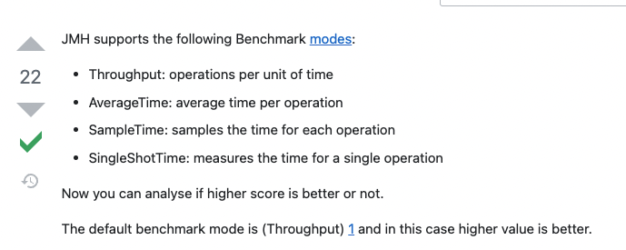

# 참고 자료
- [JMH tutorial /baeldung](https://www.baeldung.com/java-microbenchmark-harness)

# 이론

- Compilers are very good at optimizing away the redundant code. 
  객체 생성하는 코드 벤치마크해보면 아무것도 안하는것도 거의 동일한 스코어가 측정됨. 이는 컴파일러가 최적화해서 그럼 
  dead code elimination이라 불림. 객체를 리턴하면 이러한 최적화 안한다고 함. 
  또는 Blackhole이라는게 소비하도록 해도 compiler가 dead code elimination 최적화를 하지 않게 한다고 법

- 지표들의 의미
